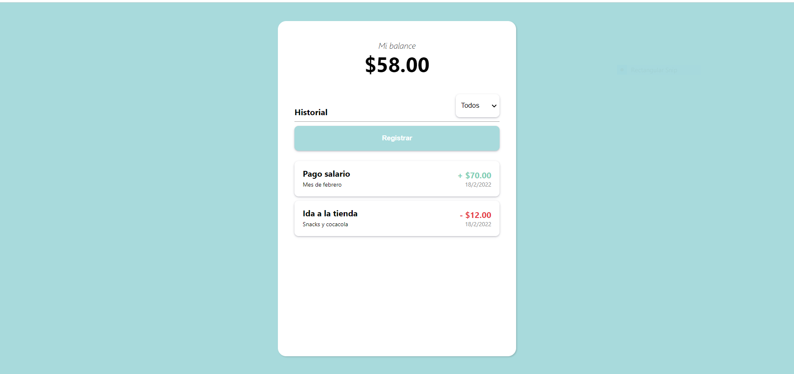
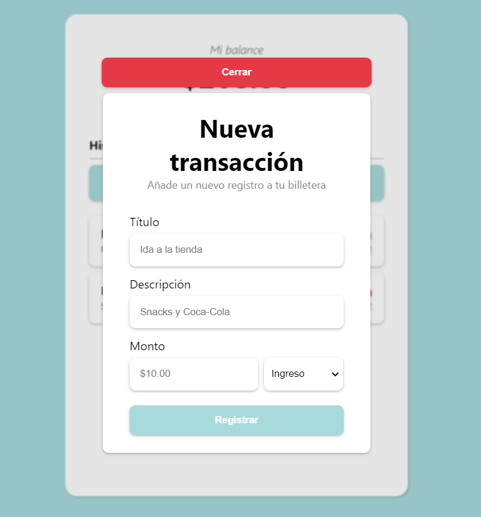

# COLD WALLET
Cold Wallet es una aplicación web que permite al usuario gestionar y llevar un control minucioso de sus transacciones monetarias; ayudandolo a mejorar sus habitos financieros.

## Características
Cold Wallet cuenta con dos caracteristicas esenciales:
- Visualización del balance actual en tiempo real. Cada nuevo registro actualizará de forma instantánea el balance mostrado en pantalla. Nada de recargar la página!
- Formulario de registro de transacciones que permite añadir nuevos items al listado, con su respectivo título, descripción, monto y tipo.
- Filtro de transacciones. Te permite filtrar entre ingresos y gastos. 

## Información Técnica
Cold Wallet es una aplicativo web de tipo SPA desarrollado con las siguientes tecnologías únicamente:
- ReactJS 
- SASS

Todos los componentes fueron desarrollados desde cero, sin hacer uso de librerías externas.

El manejo del **estado** en la aplicación fue implementado directamente haciendo uso de la API nativa de React a través del *useState*, *useContext* y *useReducer*.

### Estado Global: Modal
El componente **Modal** fue todo un reto. La implementacion del mismo fue a través de un contexto, el cual englobó la totalidad de la página principal a través de un ***ModalProvider***.

El manejo del estado del modal, al ser considerado como un toggle sencillo, fue implementado con un *useState*, el cual retornaba el estado del modal (isOpen) y su respectivo manejador de estado (setIsOpen). Asimismo, se implemento un custom hook simple (useModal), el cual provee el estado y las funciones necesarias para interactuar con el modal (open & close).

### Estado Global: Transactions
Para llevar a cabo la interacción con el estado referente al listado de transacciones registradas por el usuario y el balance general, se realizo la implementacion de un contexto específico. Esta vez, al tratarse de un estado más complejo y más extensible, se hizo uso de la api de *useReducer*,  otorgando un manejo más granular de lo que ocurre con la información del contexto.

También se implementó un custom Hook (useTransactions), el cual provee el estado a través de funciones "getters" (para evitar la interacción directa con el objeto que almacena el estado):

-**getCurrentBalance**: Retorna el balance actual del usuario y lo formatea a tipo float con dos decimales de precisión.

-**getTransactions**: Retorna el listado de transacciones actual del usuario. Asimismo, recibe un parametro filter, el cual determina el listado de transacciones a mostrar.

-**computeBalance**: Es la función encargada de actualizar el balance general al registrarse nuevas transacciones. 

-**createTransaction**: Es la función encargada de registrar nuevas transacciones a través del formulario pertinente.

# Siéntete libre de opinar
Para finalizar, sería genial recibir feedback respecto a la aplicación!

A pesar de ser sencilla, se pusieron en práctica conceptos importantes respecto al manejo del estado global y las diferentes formas de interactuar con él, así como el desarrollo de una interfaz sencilla e intuitiva para el usuario.

---
Me despido.
Happy code!